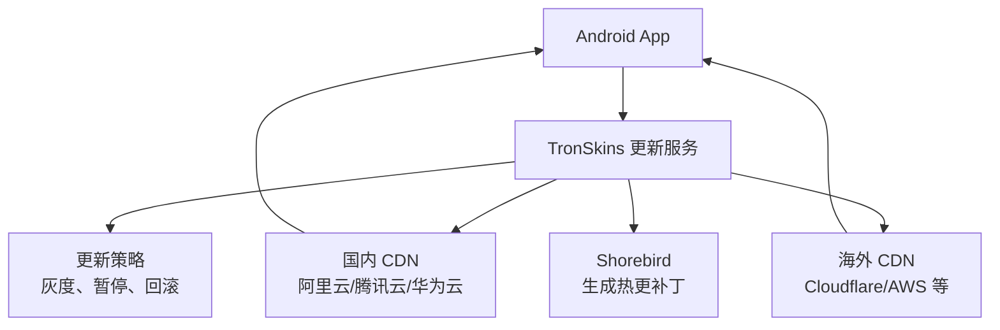

# 多元降级热更策略

> 适用范围：TronSkins Android App。
> 目标读者：产品、运营、测试、开发、项目负责人。

## 1. 这份方案要解决什么问题

我们现在使用 Shorebird 做 Flutter 热更新。它能让 Android App 在不重新安装的情况下修复部分 Dart 代码问题。

但 Shorebird 的服务器在海外，国内用户访问时可能出现：

- 检查更新慢
- 补丁下载慢
- 某些网络下无法连接
- 热更新成功率不稳定

所以我们需要加一层自己的更新服务，让国内和海外用户都能稳定获取热更新。

## 2. 最终目标

用户打开 App 后：

1. App 先访问我们的更新服务
2. 我们的服务判断用户适合走哪个下载源
3. 国内用户优先走国内 CDN
4. 海外用户优先走海外 CDN
5. 如果某个源不可用，服务端可以切换到备用源
6. 如果热更新本身有问题，可以暂停或回滚

最终效果：

- 国内用户不需要翻墙
- 海外用户访问速度也正常
- 热更新可以灰度发布
- 出问题可以快速暂停
- App 端改动尽量少

## 3. 简单理解

可以把这个方案理解成：

```text
App
  -> 我们自己的更新服务
  -> 判断用户地区和当前版本
  -> 返回最合适的补丁下载地址
  -> App 下载并安装补丁
```

我们自己的更新服务相当于一个“调度中心”。

它不一定自己生产补丁，补丁仍然可以由 Shorebird 生成；但补丁放在哪里、哪些用户能下载、下载失败怎么办，都由我们来控制。

## 4. 整体架构



## 5. 各角色负责什么

| 模块 | 作用 |
|---|---|
| Shorebird | 生成 Flutter 热更新补丁 |
| TronSkins 更新服务 | 判断是否有更新、返回哪个下载地址 |
| 国内 CDN | 给国内用户下载补丁 |
| 海外 CDN | 给海外用户下载补丁 |
| App | 检查更新、下载补丁、下次启动生效 |
| 后台策略 | 控制灰度、暂停、回滚、黑名单 |

## 6. 用户实际体验

正常情况下，用户感知很轻：

1. 用户打开 App
2. App 后台检查是否有热更新
3. 如果有补丁，后台下载
4. 下载完成后提示用户重新打开 App
5. 用户下次进入后使用新版本

如果热更新失败：

- App 不会崩溃
- 用户继续使用当前版本
- 下次启动可以再尝试
- 服务端可以切换下载源或暂停该补丁

## 7. 推荐落地步骤

### 第一步：做最小验证

目标是确认“App 能通过我们的更新服务检查热更新”。

要做的事：

- 搭建一个简单的测试更新服务
- 修改 `shorebird.yaml`，让 App 访问我们的更新服务
- 打一个测试包安装到 Android 真机
- 确认 App 的热更新请求能进入我们的服务
- 确认仍然可以正常下载和安装 Shorebird 补丁

通过标准：

- App 可以正常启动
- App 能检查到热更新
- 补丁能下载成功
- 重启 App 后补丁生效

### 第二步：接入国内和海外 CDN

目标是让补丁文件放到我们可控的下载源。

要做的事：

- Shorebird 生成补丁后，后台自动同步一份到国内 CDN
- 同步一份到海外 CDN
- 更新服务根据用户网络返回合适的 CDN 地址
- CDN 下载失败时，服务端可以切换备用源

通过标准：

- 国内设备优先从国内 CDN 下载
- 海外设备优先从海外 CDN 下载
- 任一 CDN 异常时，不影响 App 正常使用

### 第三步：增加灰度发布

目标是先给少量用户更新，确认稳定后再全量。

建议灰度节奏：

```text
内部测试
  -> 1%
  -> 10%
  -> 50%
  -> 100%
```

每一步都观察：

- 下载成功率
- App 崩溃率
- 用户反馈
- 接口错误率

### 第四步：增加暂停和回滚

目标是热更新出问题时能快速止损。

需要支持：

- 暂停某个补丁
- 只暂停某个版本
- 只暂停某个渠道
- 回滚到上一个稳定补丁
- 临时关闭热更新

## 8. App 需要改什么

主要改动很少。

### 8.1 修改 `shorebird.yaml`

建议增加：

```yaml
base_url: https://update.tronskins.com
auto_update: false
```

含义：

- `base_url`：让 App 访问我们的更新服务
- `auto_update: false`：关闭 Shorebird 自动更新，由 App 现有逻辑控制检查时机

当前项目已经有 `ShorebirdUpdateGate`，可以继续使用。

### 8.2 增加简单日志

建议记录：

- 是否检查到更新
- 下载是否成功
- 当前 App 版本
- 当前补丁版本
- 使用的是国内 CDN 还是海外 CDN
- 失败原因

这些数据用于判断热更新是否稳定。

## 9. 服务端需要做什么

服务端主要负责四件事：

1. 接收 App 的热更新检查请求
2. 判断这个用户是否应该更新
3. 返回合适的补丁下载地址
4. 记录更新成功率和失败原因

后台需要能配置：

- 是否开启热更新
- 哪个版本可以更新
- 哪个补丁可以发布
- 灰度比例是多少
- 哪些渠道暂停更新
- 是否回滚某个补丁

## 10. 发布流程

### 正常发新版

```text
开发完成
  -> 修改 App 版本号
  -> 使用 Shorebird 打正式包
  -> 测试安装包
  -> 发布到渠道
```

### 发布热更新

```text
修复 Dart 代码
  -> 使用 Shorebird 生成补丁
  -> 同步补丁到国内/海外 CDN
  -> 内部测试
  -> 小流量灰度
  -> 观察数据
  -> 全量发布
```

### 出问题时

```text
发现异常
  -> 后台暂停补丁
  -> 停止新用户下载
  -> 必要时回滚
  -> 修复后重新发补丁
```

## 11. 风险说明

| 风险 | 说明 | 应对方式 |
|---|---|---|
| Shorebird 服务不可用 | 新补丁可能无法及时同步 | 后台保留已同步补丁 |
| CDN 异常 | 部分用户下载失败 | 准备国内和海外备用源 |
| 补丁有 bug | 用户更新后可能异常 | 先灰度，再全量 |
| 配置错误 | 可能导致用户拿不到补丁 | 上线前真机验证 |
| 渠道政策差异 | 不同应用市场规则不同 | 国内渠道和海外渠道分开配置 |

## 12. 验收标准

第一版上线前，至少验证：

- 国内真机可以检查更新
- 海外真机可以检查更新
- 国内 CDN 可以下载补丁
- 海外 CDN 可以下载补丁
- 补丁安装后重启生效
- 下载失败时 App 不崩溃
- 后台可以暂停某个补丁
- 后台可以灰度发布

## 13. 推荐计划

| 阶段 | 时间 | 结果 |
|---|---|---|
| 最小验证 | 1-2 天 | 证明方案能跑通 |
| CDN 接入 | 2-3 天 | 国内外都能稳定下载 |
| 灰度和暂停 | 2-3 天 | 可以安全发布和止损 |
| 数据监控 | 1-2 天 | 能看到成功率和失败原因 |
| 小范围上线 | 1 周 | 观察真实用户表现 |

## 14. 最终建议

建议先做最小验证，不要一开始就做复杂后台。

第一阶段只需要证明三件事：

1. App 能访问我们的更新服务
2. 我们能返回可用的补丁下载地址
3. 国内和海外设备都能成功完成热更新

这三点跑通后，再逐步增加灰度、暂停、回滚和监控。
