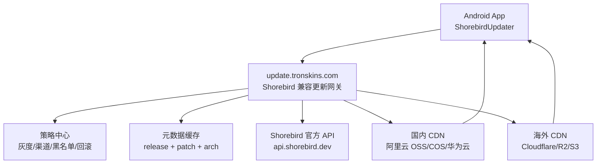

# 多元降级热更策略

> 适用范围：TronSkins Flutter App，仅考虑 Android。
> 文档日期：2026-05-13。

## 1. 结论

第三点方案可行，但不是“客户端先访问 Shorebird，失败后自动切国内 CDN”。

正确做法是：App 只访问我们自己的更新网关，例如 `https://update.tronskins.com`。网关兼容 Shorebird 的补丁检查接口，再由网关决定返回 Shorebird 官方 CDN、国内 CDN、海外 CDN 或备用源。

推荐路线：

```text
Android App
  -> update.tronskins.com/api/v1/patches/check
  -> 更新网关读取策略和缓存
  -> 必要时转发 Shorebird 官方 API
  -> 重写 patch.download_url 为国内/海外 CDN 地址
  -> Shorebird updater 下载并安装 patch
```

这个方案的价值是：用户设备不直接依赖 `api.shorebird.dev`、`storage.googleapis.com`、`cdn.shorebird.cloud` 的可达性，国内外用户都可以走我们可控的域名和 CDN。

## 2. 关键依据

Shorebird 官方架构中，客户端会先向 `api.shorebird.dev` 做 patch check，服务端返回 patch 的 `download_url`，客户端再下载 patch。官方文档也列出 Shorebird 依赖 Google Cloud、Google Cloud Storage、Cloudflare CDN 等地址。

Shorebird updater 源码中 `shorebird.yaml` 支持 `base_url` 字段，默认值是 `https://api.shorebird.dev`。补丁检查地址会拼成：

```text
{base_url}/api/v1/patches/check
```

因此我们可以把 `base_url` 指到自己的更新网关。

参考资料：

- Shorebird System Architecture: https://docs.shorebird.dev/code-push/system-architecture/
- Shorebird FAQ: https://docs.shorebird.dev/code-push/faq/
- Shorebird Update Strategies: https://docs.shorebird.dev/code-push/update-strategies/
- Shorebird Patch Signing: https://docs.shorebird.dev/code-push/guides/patch-signing/
- Shorebird updater `config.rs`: https://github.com/shorebirdtech/updater/blob/main/library/src/config.rs
- Shorebird updater `network.rs`: https://github.com/shorebirdtech/updater/blob/main/library/src/network.rs

## 3. 当前项目现状

项目已经接入 Shorebird：

- `pubspec.yaml` 已依赖 `shorebird_code_push: ^2.0.5`
- `lib/common/widgets/shorebird_update_gate.dart` 已使用 `ShorebirdUpdater`
- `shorebird.yaml` 已包含 `app_id`
- `shorebird.yaml` 当前没有真正启用 `auto_update: false`

注意：现有 `Flutter打包、Shorebird热更指南.md` 写的是“手动触发模式”，但当前 `shorebird.yaml` 中 `auto_update: false` 仍处于注释状态。要做多源降级，应先取消注释，避免 Shorebird 在启动时绕过我们的业务控制自动检查。

建议改成：

```yaml
app_id: b39a4d37-5c66-463f-960e-689390246407
base_url: https://update.tronskins.com
auto_update: false
```

## 4. 总体架构



核心原则：

- App 只信任我们的 `base_url`
- 网关对外模拟 Shorebird API
- 网关对内可访问 Shorebird 官方服务
- patch 文件镜像到国内和海外 CDN
- 网关返回最适合当前用户网络的 `download_url`
- 所有 patch 必须保留 Shorebird 原始 hash，推荐开启 patch signing

## 5. 更新链路

### 5.1 App 请求

Shorebird updater 会向我们的网关发送类似请求：

```http
POST /api/v1/patches/check
Content-Type: application/json
```

请求体示例：

```json
{
  "app_id": "b39a4d37-5c66-463f-960e-689390246407",
  "channel": "stable",
  "release_version": "1.0.1+1",
  "patch_number": null,
  "platform": "android",
  "arch": "aarch64"
}
```

### 5.2 网关处理

网关处理顺序：

1. 校验 `app_id`、`platform`、`arch`、`release_version`
2. 查询本地策略：是否暂停热更、是否灰度、是否黑名单、是否强制回滚
3. 查询本地 patch 元数据缓存
4. 缓存未命中时转发到 Shorebird 官方 API
5. 如果官方返回 patch，后台镜像 patch 文件到国内和海外 CDN
6. 根据用户来源、延迟探测、渠道策略选择下载源
7. 重写 `patch.download_url`
8. 返回 Shorebird 兼容响应

响应示例：

```json
{
  "patch_available": true,
  "patch": {
    "number": 3,
    "hash": "sha256...",
    "download_url": "https://cdn-cn.tronskins.com/shorebird/b39a4d37/android/aarch64/1.0.1+1/3/dlc.vmcode"
  },
  "rolled_back_patch_numbers": []
}
```

### 5.3 App 下载

App 收到响应后，仍由 Shorebird updater 负责下载、校验、安装和下次冷启动生效。客户端不需要自己解析 patch 文件。

## 6. 降级顺序

建议网关按照以下顺序返回下载源：

| 优先级 | 场景 | 下载源 |
|---|---|---|
| P0 | 国内用户 | 国内 CDN |
| P1 | 海外用户 | 海外 CDN |
| P2 | CDN 未命中但官方可用 | Shorebird 官方 `download_url` |
| P3 | 官方 API 临时不可用 | 使用网关缓存的最后可用 patch 元数据 |
| P4 | patch 被标记风险 | 返回 `patch_available: false` 或回滚列表 |
| P5 | 全部失败 | 不更新，继续运行当前版本 |

客户端不建议自己维护多个 patch 下载 URL，因为 `shorebird_code_push` 当前只暴露 `checkForUpdate`、`update`、`readCurrentPatch` 等高级 API，不适合在 Dart 层直接接管 patch 下载。

## 7. 服务端设计

### 7.1 必要接口

网关至少实现：

```text
POST /api/v1/patches/check
POST /api/v1/patches/events
GET  /healthz
```

`/api/v1/patches/events` 用于接收安装成功、失败等事件。可以先转发给 Shorebird，也可以同时写入我们自己的日志系统。

### 7.2 数据表

建议维护以下数据：

```text
patch_metadata
- app_id
- release_version
- platform
- arch
- channel
- patch_number
- patch_hash
- signature
- official_download_url
- cn_download_url
- global_download_url
- status: staging | active | paused | rolled_back
- created_at
- updated_at

patch_strategy
- app_id
- release_version
- channel
- rollout_percent
- min_app_version
- max_app_version
- disabled_regions
- disabled_device_ids
- force_disable
- force_rollback_patch_numbers
```

### 7.3 镜像任务

每次 `shorebird patch android` 后执行：

1. 调用我们的后台同步任务
2. 用目标 `release_version + channel + arch` 请求 Shorebird 官方 patch check
3. 获取官方 `download_url`
4. 下载 patch 文件
5. 校验 SHA256 与官方 `hash`
6. 上传到国内 CDN 和海外 CDN
7. 写入 `patch_metadata`
8. 做一次真实设备安装验证

建议 CDN 路径：

```text
/shorebird/{app_id}/android/{arch}/{release_version}/{patch_number}/dlc.vmcode
```

注意 `release_version` 中的 `+` 在 URL 中需要编码或替换，例如 `1.0.1_1`。

## 8. 客户端改造计划

### 阶段 1：配置收敛

修改 `shorebird.yaml`：

```yaml
app_id: b39a4d37-5c66-463f-960e-689390246407
base_url: https://update.tronskins.com
auto_update: false
```

目标：

- 所有 patch check 都走我们自己的网关
- 继续使用现有 `ShorebirdUpdateGate`
- 不改变用户侧更新体验

### 阶段 2：更新策略前置

在 `ShorebirdUpdateGate` 调用 `checkForUpdate` 前，先请求业务配置接口：

```text
GET /app/update-policy?version=1.0.1+1&platform=android&channel=stable
```

用于决定：

- 当前版本是否允许热更
- 是否只在 Wi-Fi 下更新
- 是否延迟到登录后更新
- 是否暂停某个 release 的 patch
- 是否展示强提示

如果策略接口不可用，默认不阻断 App，继续按普通 Shorebird 检查或本次跳过。

### 阶段 3：灰度能力

使用稳定设备分桶：

```text
bucket = hash(device_install_id + release_version) % 100
```

网关根据 `rollout_percent` 决定返回 stable/beta patch 或不返回 patch。也可以使用 Shorebird track，但最终分流逻辑建议放在我们的网关，便于统一国内外策略。

### 阶段 4：可观测性

客户端上报：

- patch check 开始/成功/失败
- download 开始/成功/失败
- 当前 `release_version`
- 当前 `patch_number`
- 网络类型
- 下载源：cn/global/official/cache
- 耗时和错误码

服务端看板至少包含：

- patch 检查成功率
- patch 下载成功率
- 各 CDN 命中率
- 按国家/地区/运营商的失败率
- patch 安装后崩溃率

## 9. 发版流程

### 9.1 新版本发布

```text
修改代码
  -> 更新 pubspec.yaml version
  -> shorebird release android --artifact apk
  -> 内测安装包验证
  -> 分发 APK/AAB
  -> 更新网关登记 release
```

### 9.2 热更发布

```text
修改 Dart 代码
  -> shorebird patch android --release-version=1.0.1+1
  -> 网关同步 Shorebird patch 元数据
  -> 镜像 patch 到国内/海外 CDN
  -> QA 设备验证
  -> 灰度 1%
  -> 观察 30-60 分钟
  -> 灰度 10%
  -> 灰度 50%
  -> 全量
```

### 9.3 回滚

优先顺序：

1. 在网关把问题 patch 标记为 `paused`
2. 返回 `patch_available: false`，阻止新设备继续下载
3. 必要时通过 `rolled_back_patch_numbers` 返回回滚列表
4. 同步在 Shorebird Console 执行 rollback
5. 崩溃率恢复后再决定是否重新发 patch

## 10. 安全要求

必须做：

- 全站 HTTPS
- 网关只允许已登记的 `app_id`
- CDN 文件只读
- patch 下载后保持 Shorebird 原始 hash
- 网关响应不要篡改 `hash`
- 后台镜像后重新计算 SHA256
- 管理后台操作留审计日志

强烈建议：

- 开启 Shorebird patch signing
- 私钥放 KMS 或密钥管理服务
- release 使用 `--public-key-path` 或 `--public-key-cmd`
- patch 使用 `--private-key-path` 或 `--sign-cmd`

示例：

```powershell
shorebird release android --public-key-path .\keys\shorebird-public.pem
shorebird patch android --private-key-path .\keys\shorebird-private.pem
```

生产环境不建议把私钥放在仓库或普通服务器磁盘。

## 11. 合规边界

只考虑 Android 时仍要区分分发渠道：

- 国内应用市场/自有分发：该方案技术上可控，重点看各市场规则。
- Google Play：需要谨慎。Google Play 政策限制从 Google Play 之外下载 dex/JAR/native code 等可执行代码。Shorebird 官方说明其设计目标是兼容商店政策，但如果我们自建代理和 CDN，建议法务/上架同学单独评估。

建议策略：

- Google Play 渠道可以继续直接走官方 Shorebird 或保守使用热更
- 国内渠道走 `update.tronskins.com` + 国内 CDN
- 通过 flavor 或 channel 区分不同分发渠道

## 12. 风险和限制

| 风险 | 说明 | 缓解 |
|---|---|---|
| `base_url` 配置不是文档主推能力 | 源码支持，但需要用当前 Shorebird 版本实机验证 | 先做 PoC |
| 官方 API 完全不可用 | 网关无法实时获取最新 patch | 使用本地缓存和发布后同步任务 |
| CDN 文件未同步完成 | 返回 URL 后下载 404 | 只有镜像校验成功才放量 |
| patch 与 release 不匹配 | 安装失败或回退 | 严格按 `release_version + arch` 维度管理 |
| 自动更新绕过策略 | 当前 `auto_update` 未关闭 | 明确设置 `auto_update: false` |
| patch 崩溃 | 用户下次启动可能回退 | 开启灰度、监控、Shorebird rollback |
| 合规风险 | 特别是 Google Play | 按渠道区分策略 |

## 13. PoC 验证清单

第一阶段只验证最小闭环：

1. 本地启动一个 mock 网关
2. `shorebird.yaml` 加 `base_url`
3. 用 `shorebird release android --artifact apk` 构建安装包
4. 设备安装后查看日志，确认请求命中 mock 网关
5. mock 网关转发官方 `/api/v1/patches/check`
6. 返回官方响应，不重写 `download_url`
7. 验证 patch 可下载并在下次冷启动生效
8. 再开启 `download_url` 重写为测试 CDN
9. 验证 hash 校验、断点续传、失败回退
10. 验证中国大陆网络和海外网络各一台真实设备

PoC 通过标准：

- App 不再直接请求 `api.shorebird.dev`
- 网关能收到 patch check
- 国内 CDN URL 可成功下载 patch
- patch 安装后 `readCurrentPatch()` 能读到新 patch number
- CDN 失败时 App 不崩溃，继续当前版本

## 14. 推荐实施排期

| 阶段 | 时间 | 产出 |
|---|---|---|
| PoC | 1-2 天 | mock 网关 + Android 真机验证 |
| 网关 MVP | 3-5 天 | `/check`、`/events`、缓存、CDN 重写 |
| 发布流水线 | 2-3 天 | patch 同步、镜像、SHA256 校验 |
| 客户端增强 | 1-2 天 | 策略接口、日志、网络条件 |
| 灰度和回滚 | 2-3 天 | 分桶、黑名单、暂停、看板 |
| 生产试运行 | 1 周 | 小流量验证，形成 SOP |

## 15. 最终建议

建议先做 `base_url + 更新网关 + CDN 重写` 的 PoC。只要当前 Shorebird 版本在真机上确认读取 `base_url` 正常，这就是成本最低、对现有 Flutter 代码侵入最小的多元降级方案。

如果 PoC 失败，再考虑更重的路线：fork Shorebird updater 或自研 Android `libapp.so` 热更链路。
